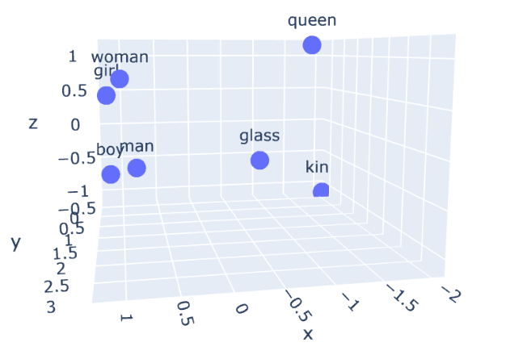
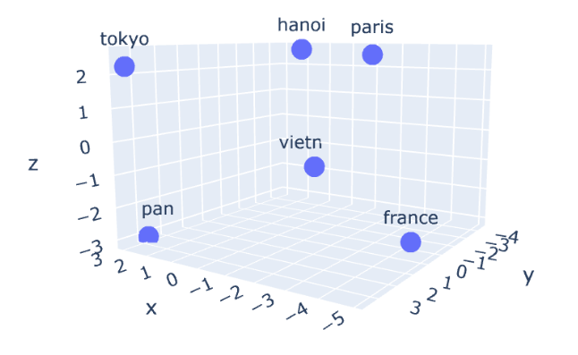
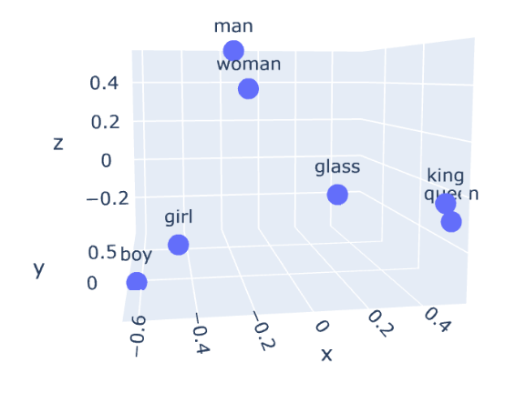

# **TIMELINE**
+ [<ins>Lab 1,2: Tokenization, Count Vectorization</ins>](#lab-12-tokenization-count-vectorization)
+ [<ins>Lab 3: Word Embeddings</ins>](#lab-3-word-embeddings)
    + [SimpleTokenizer and RegexTokenizer](#simpletokenizer-and-regextokenizer)
    + [Bag of Words](#bag-of-words)
+ [<ins>Lab 4: Text Classification</ins>](#lab-4-text-classification)

---

# **Lab 1,2: Tokenization, Count Vectorization**
---
## SimpleTokenizer and RegexTokenizer
### Implement
```
1. Define interface: Tokenizer with abstract method tokenize
Implement: SimpleTokenizer (split by [ ,.?]), RegexTokenizer (split by pattern: "\w+|[^\w\s]")
Evaluation: 
  + sample test: corpus = [
                    "Hello, world! This is a test.",
                    "NLP is fascinating... isn't it?",
                    "Let's see how it handles 123 numbers and punctuation!"
                ]
  + UD Englist EWT dataset

2. Define interface: Vectorizer with abstract method fit, transform, fit_transform
Implement: Bag of words
Evaluation: 
  + sample test: corpus = [
                    "Hello, world! This is a test.",
                    "NLP is fascinating... isn't it?",
                    "Let's see how it handles 123 numbers and punctuation!"
                ]
  + UD Englist EWT dataset
```

### Run code 
```
py -m test.lab1_test.py
```

### Result
```text
Doc1: Hello, world! This is a test.

Simple: ['hello', ',', 'world', '!', 'this', 'is', 'a', 'test', '.']
Regex: ['Hello', ',', 'world', '!', 'This', 'is', 'a', 'test', '.']
==================================================

Doc2: NLP is fascinating... isn't it?

Simple: ['nlp', 'is', 'fascinating', '.', '.', '.', "isn't", 'it', '?']
Regex: ['NLP', 'is', 'fascinating', '.', '.', '.', 'isn', "'", 't', 'it', '?']
==================================================

Doc3: Let's see how it handles 123 numbers and punctuation!

Simple: ["let's", 'see', 'how', 'it', 'handles', '123', 'numbers', 'and', 'punctuation', '!']
Regex: ['Let', "'", 's', 'see', 'how', 'it', 'handles', '123', 'numbers', 'and', 'punctuation', '!']
==================================================


Nhận xét: 
  + SimpleTokenizer tách thành các token đơn giản với khoảng trắng và các dấu câu: let's -> let's
  + RegexTokenizer tách thành các token với biểu thức chính quy: Let's -> [Let, ', s]
```


## Implement Bag of Words
### Implement
```
Implement Bag of Words with dictionary words get from corpus
Use transform to convert documents to vectors
```

### Run code 
```
py -m test.lab2_test.py
```

### Corpus
```
Document 1: "I love NLP, you love programming."
Document 2: "I love programming."
Document 3: "NLP is a subfield of AI."
```

### Vocabulary
```
{'<UNK>': 0, ',': 1, '.': 2, 'AI': 3, 'I': 4, 'NLP': 5, 'a': 6, 'is': 7, 'love': 8, 'of': 9, 'programming': 10, 'subfield': 11, 'you': 12}

==> Tạo tập từ điển từ corpus ban đầu, thêm token <UNK> đại diện cho các từ chưa từng xuất hiện trong corpus
```
### Bag of Words representation
```
bow_matrix = [
    # <UNK>, ,, ., AI, I, NLP, a, is, love, of, programming, subfield, you
    [  0,   1, 1,  0, 1,   1, 0,  0,    2,  0,          1,        0,   1],  # Doc 1
    [  0,   0, 1,  0, 1,   0, 0,  0,    1,  0,          1,        0,   0],  # Doc 2
    [  0,   0, 1,  1, 0,   1, 1,  1,    0,  1,          0,        1,   0]   # Doc 3
]

==> Từ nào xuất hiện sẽ được cộng thêm 1 đơn vị, không xuất hiện sẽ là 0.
```


## Problem: No
## Reference: No
## Pretrained Model: No


---
# **Lab 3: Word Embeddings**
## Word embedding
### Implement
```
1. Implement WordEmbedder use glove-wiki-gigaword-50 model with methods:
  + get vector: get vector of a word
  + get similar: calculate the similar between two words
  + get most similarity: get the most (top-n) similarity with a word
  + embed document: tokenizer, tranform tokens to vectors and mean.

2. Word2Vec with spark
```

### Run code
```
py -m test.lab4_test
py -m test.lab4_embedding_traninng_demo
py -m test.lab4_spark_word2vec_demo
```

### Result
#### A vector from Glove embedding (glove-wiki-gigaword-50)
```
King vector: [ 0.50451   0.68607  -0.59517  -0.022801  0.60046  -0.13498  -0.08813
  0.47377  -0.61798  -0.31012  -0.076666  1.493    -0.034189 -0.98173
  0.68229   0.81722  -0.51874  -0.31503  -0.55809   0.66421   0.1961
 -0.13495  -0.11476  -0.30344   0.41177  -2.223    -1.0756   -1.0783
 -0.34354   0.33505   1.9927   -0.04234  -0.64319   0.71125   0.49159
  0.16754   0.34344  -0.25663  -0.8523    0.1661    0.40102   1.1685
 -1.0137   -0.21585  -0.15155   0.78321  -0.91241  -1.6106   -0.64426
 -0.51042 ]
```

#### Cosine similarity
```
King and Queen cosine similarity: 0.7839043
King and Man cosine similarity: 0.53093773
```

#### Most similarity
```
Most similar words to 'computer':
computers: 0.9165045022964478
software: 0.8814992904663086
technology: 0.852556049823761
electronic: 0.812586784362793
internet: 0.8060455322265625
computing: 0.802603542804718
devices: 0.8016185760498047
digital: 0.7991793751716614
applications: 0.7912740707397461
pc: 0.7883159518241882
```

#### Embed document
```
Document: "The queen rules the country."

Document vector: [-0.02883     0.38843602 -0.589208    0.0238326   0.04681259  0.19637859
 -0.304098   -0.114218   -0.01224605 -0.46948594  0.16859959  0.23931997
 -0.211428   -0.06647549  0.4421401   0.3574676  -0.00364    -0.05688141
 -0.211428   -0.06647549  0.4421401   0.3574676  -0.00364    -0.05688141
 -0.22242197 -0.22777598  0.205385    0.0287372  -0.0434166   0.09787501
 -0.04514321 -1.7586     -0.49889272 -0.093064   -0.127166    0.0500692
  3.2685401   0.14209768 -0.45647603 -0.19275999  0.02858421 -0.05513442
 -0.22242197 -0.22777598  0.205385    0.0287372  -0.0434166   0.09787501
 -0.22242197 -0.22777598  0.205385    0.0287372  -0.0434166   0.09787501
 -0.04514321 -1.7586     -0.49889272 -0.093064   -0.127166    0.0500692
 -0.22242197 -0.22777598  0.205385    0.0287372  -0.0434166   0.09787501
 -0.22242197 -0.22777598  0.205385    0.0287372  -0.0434166   0.09787501
 -0.04514321 -1.7586     -0.49889272 -0.093064   -0.127166    0.0500692
  3.2685401   0.14209768 -0.45647603 -0.19275999  0.02858421 -0.05513442
  0.212086   -0.1230404  -0.34473377 -0.28097197 -0.31398875 -0.01450661
  0.2132518  -0.00789342 -0.356534    0.22726226 -0.34674424 -0.39744362
  0.01643366 -0.40680504]
```

#### Similarity from trained model Word2Vec
```
+---------+------------------+
|     word|        similarity|
+---------+------------------+
|  desktop|0.6893201470375061|
|computers|0.6467169523239136|
|   laptop|0.6318738460540771|
| software|0.5909299254417419|
|   device|0.5804780721664429|
+---------+------------------+
```


#### Explain
```
+ Pretrained embedding lấy từ model glove-wiki-gigaword-50, mỗi từ được ánh xạ sang một vector gồm 50 chiều, như trên từ 'king' được biểu diễn bởi một vector 50 chiều.
+ Cosine similar: đo độ tương đồng giữa hai vector từ bằng công thức cosine, giá trị càng gần 1 thì độ tương đồng càng lớn.
+ Most similarity: dựa vào cosine similar giữa từng cặp từ để trả về top_k từ có độ tương đồng lớn nhất, ở đây danh sách các từ gần với 'computer' trong không gian vector đều có sự tương đồng và liên quan lớn tới từ này trong thực tế.
+ Embed document: document được tách thành các token với RegexTokenizer, sau đó từng token sẽ được chuyển thành vector dựa trên pretrained model rồi lấy trung bình của toàn bộ vector khi đó ta được một vector biểu diễn đại diện cho toàn bộ câu.
+ Similarity from trained model Word2Vec: cho kết quả tương đối tốt, khi các từ trong top-5 (desktop, computers, laptop, software, device) đều gần nghĩa hoặc có liên quan tới từ 'computer'. Tuy nhiên so với điểm số similarity từ pretrained model có thể thấy được khả năng biểu diễn ngữ nghĩa chưa mạnh mẽ bằng.
```


## Visualize work embedding with PCA
### Implement
```
Get pretrained embedding: "word2vec-google-news-300", "glove-wiki-gigaword-300", "fasttext-wiki-news-subwords-300".
Visualize with PCA.
```

### Run code
```
word2vec_vector = gensim.downloader.load("word2vec-google-news-300")
glove_vector = gensim.downloader.load("glove-wiki-gigaword-300")
fasttext_vector = gensim.downloader.load("fasttext-wiki-news-subwords-300")

Run file 'word_embedding_visualization.ipynb'
```

### Result
#### Word2Vec


#### Glove


#### fastText


#### Explain
```
Trong phần trực quan hoá PCA với Word2Vec có thể thấy được mối quan hệ tuyến tính giữa các cặp từ: king-queen, man-woman, boy-girl; các đường nối giữa chúng dường như gần song song với nhau cho thấy khả năng biểu diễn ngữ nghĩa của Word2Vec do phương pháp huấn luyện những cặp từ này thường xuất hiện cùng nhau.

Với Glove kết quả cho ra giữa các cặp thủ đô-đất nước cũng cho kết quả tương đối giống Word2Vec.

Với fastText, kết quả cho ra không thể hiện rõ mối quan hệ tuyến tính giữa các cặp từ; tuy nhiên với các cặp từ gần nghĩa hoặc thường xuất hiện trong cùng ngữ cảnh thì tạo thành cụm tương đối rõ rêt: cụm boy-girl, man-woman, king-queen
```

## Problem:
1. Khi huấn luyện mô hình Word2Vec bị tràn bộ nhớ -> lọc bỏ bớt các từ xuất hiện ít hơn 2 lần.


## Reference: 
[Gensim](https://radimrehurek.com/gensim/) \
[PySpark](https://spark.apache.org/docs/latest/api/python/reference/index.html)

## Pretrain models
```
"word2vec-google-news-300", 
"glove-wiki-gigaword-300", 
"fasttext-wiki-news-subwords-300"
```

---
# **Lab 4: Text classification**#
## Implement
```
1. Implement text_classifier.py with some methods:
  + fit: train logistic regression model from sklearn
  + predict: use the lr model to predict test dataset
  + evaluate: return acc, precision, recall, f1_score

2. Implement spark_sentiment_analysis.py:
  + preprocessing: Tokenizer, StopWordsRemover, HashingTF, IDF
  + train model: Logistic Regression
  + evaluate: return accuracy

3. Improve text classifier: improvement_test.py
  + preprocessing: remove uncommon word
  + model: change lr -> gradient boost
```

## Run code
```
py -m test.lab5_test
py -m test.lab5_spark_sentiment_analysis
py -m test.lab5_improvement_test
```

## Result
### Simple classifier
```
data_path = "data\sentiments.csv"
Run: py -m test.lab5_test

Predicts: [ 1  1  1  1 -1  1 -1 -1 -1  1  1  1 -1  1  1 -1  1  1  1 -1 ...]
True: [-1 -1  1 -1 -1  1  1 -1 -1  1  1  1 -1 -1  1 -1  1  1  1 -1 ...]

Evaluation:
  + Accuracy: 0.7947
  + Precision: 0.8183
  + Recall: 0.8675
  + F1: 0.8422
```

### Spark sentiment analyis
```
Run: py -m test.lab5_spark_sentiment_analysis

Evaluation:
  + Accuracy: 0.7333
  + Precision: 0.7314
  + Recall: 0.7333
  + F1-score: 0.7322
```

### Improvement
```
Run: py -m test.lab5_improvement_test

Uncommon words: ['sooner', 'indicating', 'phones', '166', 'fav', 'reminder', 'reporting', 'patent', 'deals', 'cien', 'th', 'dds', 'smaller', 'email', 'chain', 'commentary', 'initiated', 'msh', '2006', '470', 'charm', 'te', 'whisper', 'tweet', 'skx', 'formed', 'uncertainty', 'pennant', 'raising', 'website', 'type', 'earning', 'model', 'strain', 'epidemic', 'peaks', 'beâ', 'paid', 'kirby', 'toe', 'search', 'tes', 'collapse', 'speculation', 'included', 'wnc', 'nti', 'ife', 'daytrade', 'nailed', 'quietly', 'send', 'fas', 'gdi', 'onxx', 'forces', 'cbs', 'nxt', 'smartphone', 'itâ', 'emerging', 'bcd', 'advisors', 'purchases', 'doubled', 'employee', 'bases', 'thank', 'ty', 'ceiling', '434', 'dude', 'amwd', 'mp', ...]

Evaluation:
  + Accuracy: 0.7023
  + Precision: 0.7065
  + Recall: 0.9044
  + F1: 0.7933

```

## Explain
```
Dữ liệu được lấy từ: "data\sentiment.csv", chia thành train và test với tỉ lệ 80:20.
Toàn bộ sau đó câu sau đó được tokenizer, sau đó được vector hoá với 2 phương pháp: CountVectorizer, Pretrained embedding
Các chỉ số đánh giá được lấy từ kết quả dự đoán của mô hình so với nhãn thât.

Phương pháp gốc: CountVectorizer + Logistic Regression cho kết quả tương đối tốt với Acc: 79,47% và F1: 84,22%

Spark: RegexTokenizer + StopwordRemover + HashingTF + IDF, cho kết quả thấp hơn với Acc: 73,33 và F1: 73,22

Phương pháp cải thiện: RegexTokenizer + RemoveUncommonWord + GradientBoostingClassifier, cho kết quả với Acc: 0.7023 và F1: 0.7933
```

## Problem
1. Đã thử cải thiện bằng một số phương pháp tiền xử lý, cũng như thay đổi thành các mô hình phân loại hiệu quả hơn tuy nhiên các phương pháp đều cho hiệu suất kém hơn so với mô hình gốc ban đầu.

## Reference
[Sklearn](https://scikit-learn.org/stable/index.html) \
[PySpark](https://spark.apache.org/docs/latest/api/python/reference/index.html)


# **Lab 5: Token classification**#
## 5.1 Pytorch introduction
### Implement
```
1. Tensor: 
  + create tensor
  + tensor operation
  + index, slicing
  + view, reshape

2. Autograd

3. First model pytorch with nn.Module
```

### Run code
```
run: src/notebook/lab5_pytorch_intro.ipynb
```

### Result
#### Operation
```
X data: 
 tensor([[1, 2],
        [3, 4]])

X total: 
 tensor([[2, 4],
        [6, 8]])

X mul: 
 tensor([[ 5, 10],
        [15, 20]])

X matmul: 
 tensor([[ 5, 11],
        [11, 25]])
```

#### Simple model
```
Input tensor 
 tensor([1, 5, 0, 8])
Input shape: torch.Size([4])
Output shape: torch.Size([4, 2])
Output: tensor([[-0.0332,  0.4619],
        [ 0.0808,  0.3076],
        [ 0.1161,  0.2583],
        [ 0.1682,  0.1902]], grad_fn=<AddmmBackward0>)
```

#### Explain
```
Embedding matrix: 
  tensor([[ 1.4451,  0.8564,  2.2181],
          [ 0.5232,  0.3466, -0.1973],
          [-1.0546,  1.2780, -0.1722],
          [ 0.5238,  0.0566,  0.4263],
          [ 0.5750, -0.6417, -0.4976],
          [ 0.4747, -2.5095,  0.4880],
          [ 0.7846,  0.0286,  0.6408],
          [ 0.5832,  0.2191,  0.5526],
          [-0.1853,  0.7528,  0.4048],
          [ 0.1785,  0.2649,  1.2732]], requires_grad=True)

Input: [1, 5, 0, 8] -> Lần lượt lấy ra các hàng tương ứng với index, các hàng này chính là vector biểu diễn cho từ.

Output:
  tensor([[-0.0332,  0.4619],
        [ 0.0808,  0.3076],
        [ 0.1161,  0.2583],
        [ 0.1682,  0.1902]], grad_fn=<AddmmBackward0>)

==> Đầu ra có kích thước là (4,2) tương ứng với 4 tokens ở phía trên, mỗi từ được biểu diễn bởi 1 vector hai chiều do được đi qua nn.Linear(3, 2)
```

## 5.2 Text classification with Pytorch
### Implement
```
1. TF-IDF + Logistic Regression

2. Word2Vec + Dense

3. Embedding Pre-trained + LSTM

4. Embedding from scratch + LSTM

5. Evaluate and Comparison
```

### Run code
```
run: src/notebook/lab5_rnn_text_classification.ipynb
```

### Result
```
1. Hwu dataset
| Mô hình                        | F1-score | Precision | Recall | Loss     |
|--------------------------------|----------|-----------|--------|----------|
| TF-IDF + Logistic Regression   | **0.84** | 0.85      | 0.83   | N/A      |
| Word2Vec + Dense               | 0.38     | 0.38      | 0.40   | 2.0383   |
| Embedding (Pre-trained) + LSTM | 0.45     | 0.47      | 0.46   | 1.8702   |
| Embedding (Scratch) + LSTM     | 0.00     | 0.00      | 0.02   | 4.1512   |

2. Some samples
Texts: 
  [
    "can you remind me to not call my mom",
    "is it going to be sunny or rainy tomorrow",
    "find a flight from new york to london but not through paris"
  ]

Ground true:['reminder_create', 'weather_query', 'flight_search']

Logistic Regression:
['calendar_set' 'weather_query' 'general_negate']

Word2vec + Dense:
['email_query' 'weather_query' 'email_sendemail']

Embedding (Pretrained) + LSTM:
['takeaway_query' 'weather_query' 'social_post']

Embedding (Scratch) + LSTM:
['alarm_set' 'alarm_set' 'alarm_set']

```

### Explain
```
TF-IDF + Logistic Regresion cho kết quả tốt nhất trong cả 4 phương pháp (Scratch dang lỗi) với F1-score là 0.84. 
Word2Vec + Dense cho F1-score là 0.38, Embedding (Pre-trained) + LSTM cho F1-Score là 0.46 cho thấy sự cải thiện hiệu suất tương đối đáng kể của LSTM so với việc chỉ tính trung bình của các vector.
==> Việc sử dụng trung bình để tạo đại diện cho một câu có thể đã làm các phần thông tin bị hoà trộn vào nhau do đó khi xây dựng mô hình khiến hiệu quả tương đối thấp, thay vào đó sử dụng LSTM cho thấy một cải thiện từ 0.38 lên 0.46
```

### Problem
```
Theo giả thuyết phương pháp hiện đại biểu diễn vector bằng embedding, mô hình phân loại với LSTM sẽ cho lại hiệu quả cao hơn so với pipeline TF-IDF + Logistic Regression. Tuy nhiên thực tế huấn luyện lại không phản ánh được điều đó.

Mô hình Embedding Scratch đang gặp lỗi dù sử dụng toàn bộ input của phương pháp 3 Embedding Pretrained
```

### Reference
[Sklearn](https://scikit-learn.org/stable/index.html) \
[Tensorflow](https://www.tensorflow.org/)
[Pytorch](https://pytorch.org/)


## 5.3 Token classification with Pytorch (Pos tagging)
### Implement
```
1. Build class Vocabulary (src/core/build_vocab.py)
  + function: build_index -> word_to_idx, tag_to_idx

2. Dataset, DataLoader (src/loader/pos_dataloader.py)
  + POSDataset
  + custom_collate_fn: padding to max_len in a batch

3. Build RNN model for pos tagging
```

### Run code
```
Run: py -m test.lab5_pos_tagging.py
```

### Trained model
```
model: trained_model/pos_tagging_model.pth
```

### Result
```
1. UD English EWT
Test dataset:
  + Loss: 0.3205 
  + Acc: 0.9572

2. Sample test
Text: "Transformers acts as the model definition framework for SOTA machine learning models in text, computer vision, audio, video, and multimodal model, for both inference and training."

Ouput: [('Transformers', 'PROPN'), ('acts', 'PROPN'), ('as', 'PROPN'), ('the', 'DET'), ('model', 'NOUN'), ('definition', 'VERB'), ('framework', 'PROPN'), ('for', 'PROPN'), ('SOTA', 'PROPN'), ('machine', 'PROPN'), ('learning', 'VERB'), ('models', 'NUM'), ('in', 'ADP'), ('text,', 'PROPN'), ('computer', 'NOUN'), ('vision,', 'PROPN'), ('audio,', 'PROPN'), ('video,', 'PROPN'), ('and', 'PROPN'), ('multimodal', 'PROPN'), ('model,', 'PROPN'), ('for', 'PROPN'), ('both', 'PROPN'), ('inference', 'PROPN'), ('and', 'PROPN'), ('training.', 'PROPN')]
```

### Explain
```
1. Build vocab: Xây dựng bộ từ vựng với word_to_idx (ánh xạ từ sang chỉ số), tag_to_idx (ánh xạ nhãn sang idx)

2. PosDataset, Dataloader định nghĩa hàm **custom_collate_fn** để đưa tất cả các vector trong một batch về cùng một kích thước khi training

3. SimpleRNNForTokenClassification: Sử dụng hidden state từ LSTM tại mỗi token để dự đoán đầu ra pos tagging. Kết quả trả về là tuple (text, pos)
```

### Problem
```
Không gặp vấn đề gì
```

### Reference
[Pytorch](https://pytorch.org/)

## 5.4 Token classification with Pytorch (Ner)
### Implement
```
1. Build class Vocabulary (src/core/build_vocab_ner.py)
  + function: build_index -> word_to_idx, tag_to_idx
  + (<PAD>: 0, <UNK>: 1)
2. Dataset, DataLoader (src/loader/ner_dataloader.py)
  + NERDataset 
  + custom_collate_fn: padding to max_len in a batch

3. Build RNN model for ner
```

### Run code
```
Run: py -m test.lab5_ner_tagging.py
```

### Trained model
```
model: trained_model/ner_model.pth
```

### Result
```
1. UD English EWT
Test dataset:
  + Loss: 0.5824 
  + Acc: 0.2718

2. Sample test
Sample test: "VNU University is located in Hanoi"  

[('VNU', 'B-PER'), ('University', 'I-ORG'), ('is', 'O'), ('located', 'O'), ('in', 'O'), ('Hanoi', 'B-LOC')]
```

### Explain
```
1. Build vocab: Xây dựng bộ từ vựng với word_to_idx (ánh xạ từ sang chỉ số), tag_to_idx (ánh xạ nhãn sang idx)

2. NERDataset, Dataloader định nghĩa hàm **custom_collate_fn** để đưa tất cả các vector trong một batch về cùng một kích thước khi training

3. SimpleRNNForTokenClassification: Sử dụng hidden state từ LSTM tại mỗi token để dự đoán đầu ra ner. Kết quả trả về là tuple (text, ner)
```

### Problem
```
Không gặp vấn đề gì
```

### Reference
[Pytorch](https://pytorch.org/)


# **Lab6: Transformer**
## Implement
```
1. Masked Language Model
2. Next Token Prediction
3. Sentence Representation
```

## Run code
```
py -m test.lab6_intro_transformers
```

## Result
### Masked Language Token
```
Câu gốc: Hanoi is the <mask> of Vietnam.
Dự đoán: 'capital' với độ tin cậy: 0.9354
 -> Câu hoàn chỉnh: Hanoi is the capital of Vietnam.
Dự đoán: 'center' với độ tin cậy: 0.0251
 -> Câu hoàn chỉnh: Hanoi is the center of Vietnam.
Dự đoán: 'heart' với độ tin cậy: 0.0109
 -> Câu hoàn chỉnh: Hanoi is the heart of Vietnam.
Dự đoán: 'centre' với độ tin cậy: 0.0032
 -> Câu hoàn chỉnh: Hanoi is the centre of Vietnam.
Dự đoán: 'city' với độ tin cậy: 0.0030
 -> Câu hoàn chỉnh: Hanoi is the city of Vietnam.

==> Mô hình dự đoán đúng 'capital'
==> Các mô hình Encoder-only như BERT phù hợp đặc biệt tốt cho tác vụ dự đoán từ <mask> vì kiến trúc encoder của Transformer được thiết kế để hiểu ngữ nghĩa hai chiều. Do đó nếu trong câu có 1 từ bị che, mô hình sẽ sử dụng được ngữ cảnh trước và sau để dự đoán từ phù hợp nhất.
```

### Next token prediction
```
Câu mồi: 'The best thing about learning NLP is'

Văn bản được sinh ra:
The best thing about learning NLP is that it offers a way to understand and interpret how people communicate, including nonverbal cues, emotions, and language. It's not just about the language itself, but how people use it. The field is rapidly growing, and it's becoming more and more important in our daily lives. It's a powerful tool for professionals who work with language, including those in education, business, and healthcare.

NLP can be used in multiple ways, including in the workplace, in education, and in healthcare.

==> Kết quả sinh ra tương đối hợp lý.
==> Các mô hình Decoder-only phù hợp và đặc biệt tốt cho tác vụ sinh văn bản vì kiến trúc decoder của Transformer được thiết kế chính xác cho việc dự đoán token tiếp theo theo chiều trái → phải.
```

### Sentence Representation
```
sentences = [
    "This is a sample sentence.",
    "Attentions weights after the attention softmax, used to compute the weighted average in the self-attention heads."           
]

{'input_ids': 
  + tensor([[  101,  2023,  2003,  1037,  7099,  6251,  1012,   102,     0,     0,
             0,     0,     0,     0,     0,     0,     0,     0,     0,     0,
             0,     0,     0,     0],
          [  101,  3086,  2015, 15871,  2044,  1996,  3086,  3730, 17848,  1010,
          2109,  2000, 24134,  1996, 18215,  2779,  1999,  1996,  2969,  1011,
          3086,  4641,  1012,   102]])}

Vector biểu diễn của câu:
tensor([[-0.0639, -0.4284, -0.0668,  ..., -0.1753, -0.1239,  0.3197],
        [-0.1905, -0.3300,  0.3282,  ...,  0.0159, -0.0221, -0.1398]])

Kích thước của vector: torch.Size([2, 768])

==> Kích thước của vector biểu diễn là 768, tương ứng với hidden dim của BERT
==> Sử dụng attention mask vì có phần padding để tạo ra độ dài câu khác nhau, do đó cần mask để bỏ qua phần được thêm vào.
```

## Pretrained model
```
Masked Language Token: xlm-roberta-base
Next token prediction: Qwen/Qwen3-0.6B
Sentence Representation: bert-base-uncased
```

## Problem
No

## Reference
[PySpark](https://spark.apache.org/docs/latest/api/python/reference/index.html)
[Hugging Face](https://huggingface.co/)

