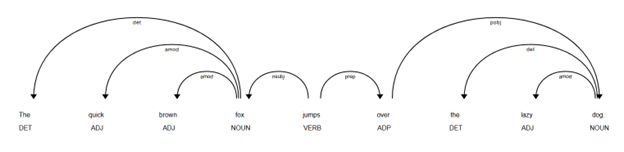

# **Lab6: Transformer**
## Implement
```
1. Dependency parsing with Spacy
    + Analysis sentence
    + Visualize dependency
    + Tree dependency: find nsubj, dobj, amod

2. Additional exercise
    + find main verb of a token
    + get noun chunks
    + get path to the root
```

## Run code
```
Run: lab6_dependency_parsing.ipynb
```

## Result
### Visualization

```
Từ gốc (ROOT) của câu: jumps
Từ jumps có những từ phụ thuộc (dependent): fox, over 
    + fox: nsubj
    + over: prep
Từ fox là head của từ: The, quick, brown 

```


### Dependency
```
Sentence: "Apple is looking at buying U.K. startup for $1 billion"

TEXT         | DEP        | HEAD TEXT    | HEAD POS | CHILDREN
----------------------------------------------------------------------
Apple        | nsubj      | looking      | VERB     | []
is           | aux        | looking      | VERB     | []
looking      | ROOT       | looking      | VERB     | ['Apple', 'is', 'at']
at           | prep       | looking      | VERB     | ['buying']
buying       | pcomp      | at           | ADP      | ['startup']
U.K.         | compound   | startup      | NOUN     | []
startup      | dobj       | buying       | VERB     | ['U.K.', 'for']
for          | prep       | startup      | NOUN     | ['billion']
$            | quantmod   | billion      | NUM      | []
1            | compound   | billion      | NUM      | []
billion      | pobj       | for          | ADP      | ['$', '1']
```


### Tree dependency
#### Find nsubj and dobj
```
Sentence: "The cat chased the mouse and the dog watched them."

Found Triplet: (cat, chased, mouse)
Found Triplet: (cat, chased, mouse)
Found Triplet: (cat, chased, mouse)
Found Triplet: (dog, watched, them)
Found Triplet: (dog, watched, them)
```


#### Find amod
```
Sentence: "The big, fluffy white cat is sleeping on the warm mat."

Danh từ 'cat' được bổ nghĩa bởi các tính từ: ['big']
Danh từ 'cat' được bổ nghĩa bởi các tính từ: ['big']
Danh từ 'cat' được bổ nghĩa bởi các tính từ: ['big', 'fluffy']
Danh từ 'cat' được bổ nghĩa bởi các tính từ: ['big', 'fluffy', 'white']
Danh từ 'mat' được bổ nghĩa bởi các tính từ: ['warm']
```

### Additional exercise
```
Sentence: "The quick brown fox jumps over the lazy dog."

+ Find main verb: Root token of sentence: The quick brown fox jumps over the lazy dog. - jumps
+ Noun chunks from sentence: The quick brown fox jumps over the lazy dog.: 
    ['The quick brown fox', 'the lazy dog']

+ Path to the root:
    Path to the root of 'The' from 'The quick brown fox jumps over the lazy dog.': 
    The->fox->jumps

    ----
    Path to the root of 'quick' from 'The quick brown fox jumps over the lazy dog.': 
    quick->fox->jumps

    ----
    Path to the root of 'brown' from 'The quick brown fox jumps over the lazy dog.': 
    brown->fox->jumps

    ----
    Path to the root of 'fox' from 'The quick brown fox jumps over the lazy dog.': 
    fox->jumps

    ----
    Path to the root of 'jumps' from 'The quick brown fox jumps over the lazy dog.': 
    jumps->jumps

    ----
    Path to the root of 'over' from 'The quick brown fox jumps over the lazy dog.': 
    over->jumps

    ----
    Path to the root of 'the' from 'The quick brown fox jumps over the lazy dog.': 
    the->dog->over->jumps

    ----
    Path to the root of 'lazy' from 'The quick brown fox jumps over the lazy dog.': 
    lazy->dog->over->jumps

    ----
    Path to the root of 'dog' from 'The quick brown fox jumps over the lazy dog.': 
    dog->over->jumps

    ----
    Path to the root of '.' from 'The quick brown fox jumps over the lazy dog.': 
    .->jumps
```


## Pretrained model
```
Spacy model: en_core_web_md 
```

## Problem: No

## Reference
[Spacy](https://spacy.io/)
